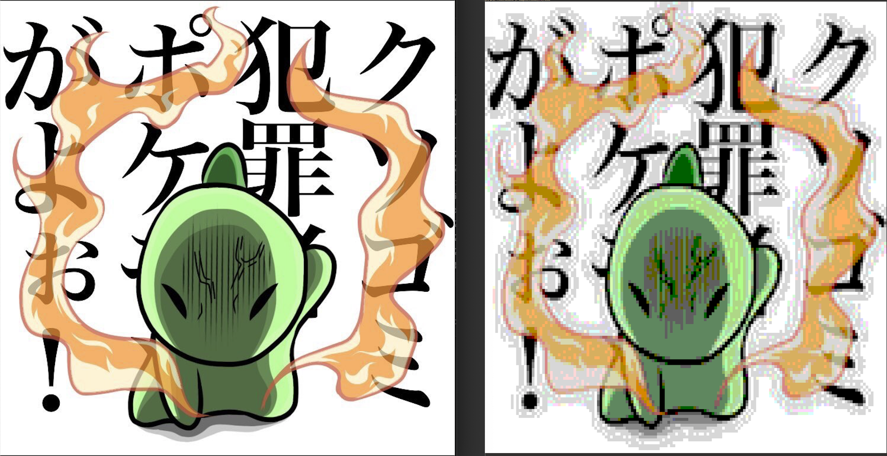

# CMagick

Welcome to your new gem! In this directory, you'll find the files you need to be able to package up your Ruby library into a gem. Put your Ruby code in the file `lib/cmagick`. To experiment with that code, run `bin/console` for an interactive prompt.

It is a gem that can display images on the console.

## Installation

Add this line to your application's Gemfile:

```ruby
gem 'cmagick'
```

And then execute:

    $ bundle install

Or install it yourself as:

    $ gem install cmagick

## Usage

```
cmagick = CMagick::LoadImage.new('/path/to/img.jpg')
cmagick.show
```

if img is big size

```
cmagick.resize(0.1).show
```

This gem uses RMagick.
You can control the image that can be displayed by giving it as an argument.

```
rmagick = Magick::ImageLIst.new('/path/to/img.jpg')
#
# rmagick process...
#

cmagick = CMagick::LoadImage.new(image: rmagick)
```

## Example

Left: original

Right: convert ansi code



source: https://twitter.com/raibarori/status/1028576227571847168/photo/1


## Development

After checking out the repo, run `bin/setup` to install dependencies. Then, run `rake spec` to run the tests. You can also run `bin/console` for an interactive prompt that will allow you to experiment.

To install this gem onto your local machine, run `bundle exec rake install`. To release a new version, update the version number in `version.rb`, and then run `bundle exec rake release`, which will create a git tag for the version, push git commits and tags, and push the `.gem` file to [rubygems.org](https://rubygems.org).

## Contributing

Bug reports and pull requests are welcome on GitHub at https://github.com/TsuMakoto/cmagick. This project is intended to be a safe, welcoming space for collaboration, and contributors are expected to adhere to the [code of conduct](https://github.com/TsuMakoto/cmagick/blob/master/CODE_OF_CONDUCT.md).


## Code of Conduct

Everyone interacting in the CMagick project's codebases, issue trackers, chat rooms and mailing lists is expected to follow the [code of conduct](https://github.com/TsuMakoto/cmagick/blob/master/CODE_OF_CONDUCT.md).
